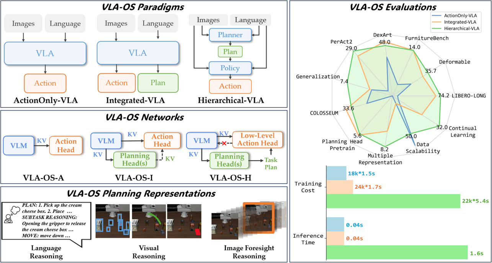

# VLA-OS: Structuring and Dissecting Planning Representations and Paradigms in Vision-Language-Action Models

### 📝[Paper](https://arxiv.org/abs/2506.17561) | 🌍[Project Page](https://nus-lins-lab.github.io/vlaos/) | 🤗[Model](https://huggingface.co/Linslab/VLA-OS) | 🛢️[Data](https://huggingface.co/datasets/Linslab/VLA-OS-Dataset) 



VLA-OS is a unified framework for planning representations and paradigms research in vision-language-action (VLA) models. Specifically, VLA-OS offers the following features:

- 🏗️ **Advanced VLA Designs**  
  VLA-OS integrates multiple cutting-edge VLA design elements, including support for [multi-view historical inputs](https://robovlms.github.io/), [action chunking](https://tonyzhaozh.github.io/aloha/), a separate [action head](https://www.physicalintelligence.company/blog/pi0), [block-wise causal attention for extracting visual-language model (VLM) features](https://www.physicalintelligence.company/blog/pi0), and support for both [L1 loss](https://openvla-oft.github.io/) and [flow-matching loss](https://www.physicalintelligence.company/blog/pi0) within a single network architecture.

- 🔗 **Modular, Scalable VLM Backbone**  
  VLA-OS is agnostic to the choice of large-language or visual-language models: any Hugging Face LLM/VLM can be employed. [Our paper](https://arxiv.org/abs/2506.17561) presents model-scalability experiments on the same LLM model architecture ([Qwen2.5](https://github.com/QwenLM/Qwen2.5-VL)) with only different number of parameters.

- 🛠️ **Composable Planning Heads for Different Planning Representations**  
  A suite of composable planning heads is provided for different task planning representations: language reasoning, visual reasoning, and image foresight reasoning. Each of them can be seamlessly attached to the VLM backbone.

- 🔄 **Different Planning Paradigms**  
  Using a unified codebase, VLA-OS implements three planning paradigms: Action-Only VLA, Integrated VLA, and Hierarchical VLA, enabling flexible exploration of planning strategies.

This repo is an official PyTorch implementation of VLA-OS, containing:

- 🛠️VLA-OS model [implementation](https://github.com/HeegerGao/VLA-OS/tree/main/vlaos/models).
- 🤗[Dataset](https://huggingface.co/datasets/Linslab/VLA-OS-Dataset) of VLA-OS of [LIBERO](https://libero-project.github.io/intro.html), [The Colosseum](https://robot-colosseum.github.io/), [FurnitureBench](https://clvrai.github.io/furniture-bench/), [DexArt](https://www.chenbao.tech/dexart/), [PerAct2](https://bimanual.github.io/), and Real-World Deformable Object Manipulation tasks.
- 🤗[Checkpoint](https://huggingface.co/Linslab/VLA-OS) of VLA-OS.
- 📈Training [scripts](https://github.com/HeegerGao/VLA-OS/tree/main/scripts) (with DeepSpeed Accelerator for VLA and FSDP for VLM).
- 🤖Data transformation [scripts](https://github.com/Panda-Shawn/VLA-OS-Language-Planning-Labeling) for your own dataset.
- 🕹️Planning Data Labeling [scripts](https://github.com/Panda-Shawn/VLA-OS-Language-Planning-Labeling) for your custom dataset.

The following guides include the [installation](#installation), [VLM Pretraining](#vlm-pretraining), [VLA Training](#vla-training), and [Training on your own dataset](#training-on-your-own-dataset). 

## 📰 News
- [2025/06/24] 🔥 Training Code released!

## TODO
[] Add training code for continual learning
[] Add evaluation code


## Installation

This installation is for NVIDIA A100 80G with cuda 12.6.

```bash
# Clone this repo
git clone git@github.com:HeegerGao/VLA-OS.git

# Create a Conda environment
conda create -n vla python=3.10
conda activate vla

# Install PyTorch
pip3 install torch torchvision torchaudio

# Install LIBERO
git clone https://github.com/Lifelong-Robot-Learning/LIBERO.git
cd LIBERO
pip install -r requirements.txt
pip install -e .

# Install dlimp
git clone https://github.com/kvablack/dlimp
cd dlimp
pip install -e .

# Install Flash Attention
pip install flash-attn --no-build-isolation

# Install other prequisites
pip install -r requirements.txt
```

## VLM Pretraining

1. Download the llava-v1.5-instruct Dataset

You can download it according to the Prismatic-VLMs [instruction](https://github.com/TRI-ML/prismatic-vlms/tree/main?tab=readme-ov-file#pretraining-datasets). Then move the unzipped dataset folder:
<!-- You can eiter download it according to the Prismatic-VLMs [instruction](https://github.com/TRI-ML/prismatic-vlms/tree/main?tab=readme-ov-file#pretraining-datasets), or download it from our organized [HuggingFace version](https://huggingface.co/datasets/Linslab/VLA-OS-Dataset/tree/main/llava-v1.5-instruct). Then move the unzipped dataset folder: -->

```bash
cd VLA-OS
mkdir dataset
mv YOUR_llava-v1.5-instruct_FOLDER dataset
```

2. Train the VLM

```bash
bash commands/pertrain_vlm.sh --config=config/train_vlm.yaml
```

If you do not want to train the VLM by yourself, you can directly download the pretrained VLM checkpoint [here](https://huggingface.co/Linslab/VLA-OS/tree/main/Qwen2.5-VLM).

## VLA Training

1. Put your pretrained VLM checkpoint under `runs/qwen25-dinosiglip-224px+0_5b+stage-finetune+x42/checkpoints/latest-checkpoint.pt`.

2. Download pretrained VAE (infinity_vae_d32reg.pth) for Image Foresight Planning from [here](https://huggingface.co/Linslab/VLA-OS/blob/main/auxiliary/infinity_vae_d32reg.pth).

3. Download the training datasets from [our huggingface dataset repo](https://huggingface.co/datasets/Linslab/VLA-OS-Dataset).

4. Run the training script with the corresponding config. For example, train Integrated VLA on LIBERO-10:

```bash
bash commands/train_vla.sh --config=config/libero/libero_10/train_integrated_vla.yaml
```

Note if you want to train the Hierarchical VLA, you should first train a Integrated VLA to get the high-level checkpoint, and then train the low-level action head with it. Please refer to our paper for more details.


## Training on Your Own Dataset

Please refer to this [repo](https://github.com/Panda-Shawn/VLA-OS-Language-Planning-Labeling) for more instructions.

## Citation

If you find our work helpful, please cite us:

```bibtex
@article{gao2025vlaos,
  title   = {VLA-OS: Structuring and Dissecting Planning Representations and Paradigms in Vision-Language-Action Models},
  author  = {Gao, Chongkai and Liu, Zixuan and Chi, Zhenghao and Huang, Junshan and Fei, Xin and Hou, Yiwen and Zhang, Yuxuan and Lin, Yudi and Fang, Zhirui and Jiang, Zeyu and Shao, Lin},
  journal = {arXiv preprint arXiv:2506.17561},
  year    = {2025},
  url     = {https://arxiv.org/abs/2506.17561}
}
```

Thank you!

## License

All the code, model weights, and data are licensed under [MIT license](./LICENSE).